# Implementing OAuth 2.0 Client Credentials Flow with AWS Cognito for Secure Server-to-Server Communication

In today's interconnected digital landscape, secure communication between servers is paramount. 
As organizations continue to expand their digital footprint, the need for robust authentication and authorization mechanisms becomes more critical than ever. 
This is where OAuth 2.0 steps in—a powerful protocol that enforces and facilitates secure access to resources on behalf of users or applications, without exposing sensitive credentials.

In the realm of server-to-server communication, the OAuth 2.0 Client Credentials Flow emerges as a reliable solution. 
This flow enables servers to securely communicate with one another, requesting and exchanging data without user involvement. 
It's a practical scenario that finds applications in microservices architectures, API-driven interactions, and various other server-based interactions.

To delve into the real-world implementation of the OAuth 2.0 Client Credentials Flow, we turn to Amazon Web Services (AWS) Cognito — the authentication and authorization service that provides scalable user identity management. 
Leveraging AWS Cognito as our Authorization Server, we'll demonstrate how to set up a seamless and secure server-to-server communication channel.

Throughout this article, we'll guide you through the configuration steps required within AWS Cognito to establish this communication paradigm. 
But we won't stop there. We recognize that theory only goes so far. 
To truly grasp the implementation process, we'll provide you with a hands-on experience. 
We'll walk you through the creation of two Java Web applications, each fortified with a robust security layer to ensure authorized interactions.

By the end of this article, you'll not only comprehend the concepts and benefits of OAuth 2.0 Client Credentials Flow but also possess the practical knowledge to implement it effectively using AWS Cognito. 
So, whether you're an application developer, a system architect, or an enthusiast eager to enhance your understanding of secure server communications, this article aims to equip you with the insights and skills you need.

Let's embark on a journey to establish a secure server-to-server communication channel—powered by the OAuth 2.0 Client Credentials Flow and AWS Cognito. 
Through a blend of theory and practical implementation, you'll soon find yourself well-versed in orchestrating secure interactions in the dynamic landscape of modern server communication.

## Understanding OAuth 2.0

Before we dive into the practical implementation using AWS Cognito, let's lay the foundation by understanding the core concepts and benefits of the OAuth 2.0 protocol. 
OAuth 2.0, often referred to simply as OAuth, is an industry-standard authorization protocol that enables secure access to resources by allowing applications to obtain limited access to a user's account on behalf of that user.

Key OAuth 2.0 concepts include:
1. Clients and Resources: In the context of OAuth 2.0, a client is an application seeking access to protected resources, and a resource server hosts these protected resources. These resources could be anything from user data to APIs, and the client's goal is to access these resources without exposing sensitive credentials.
2. Authorization Server: The authorization server is responsible for authenticating the client and user, as well as issuing access tokens after the user grants consent. These access tokens are then used by the client to access the protected resources on the resource server.
3. Access Tokens: Access tokens are the centerpiece of OAuth 2.0. They are short-lived credentials that a client application uses to access resources on behalf of the user. Access tokens are specific to a particular scope (what the token allows access to) and duration (how long the token is valid).
4. Grant Types: OAuth 2.0 defines several grant types, each designed to address different use cases and security requirements. These grant types include:
- Authorization Code Grant: Used in web applications where the client can securely maintain a client secret and user is directly involved in the authorization process. It involves a multi-step process that involves user redirection and authorization codes exchange.
- Implicit Grant: Primarily used for single-page applications or mobile apps, this grant type doesn't involve issuing a client secret. Access tokens are returned immediately to the client.
- Password Grant: Allows the client to exchange the user's credentials for an access token. Not recommended for public clients due to security concerns.
- Client Credentials Grant: Our focus here, this grant type enables server-to-server communication without involving user authentication. It's ideal for situations where the client itself is the resource owner or when users are not involved in the communication.

## The Client Credentials Flow: Benefits and Use Cases

The Client Credentials Flow, a key part of OAuth 2.0, is particularly suited for scenarios where a client application (typically a server) needs to access resources on its own behalf, without acting on behalf of a user. 
This makes it perfect for server-to-server communication, where two backend servers need to interact securely and efficiently.

Benefits of the Client Credentials Flow:

- Efficiency: The absence of user involvement streamlines the communication process, reducing unnecessary redirects and interactions.
- Security: Sensitive user credentials are not exposed in the communication, enhancing security.
- Scope-Based Access: Access tokens can be tailored to have limited permissions, ensuring that the client only accesses what it needs.
- Token Revocation: In case of security breaches, access tokens can be revoked independently, minimizing the impact.

The Client Credentials Flow, while extremely useful, should be chosen carefully based on the specific use case. For user-centric interactions, other grant types that involve user authentication might be more suitable.

Now that we've established a solid understanding of OAuth 2.0 and the significance of the Client Credentials Flow, let's transition to the practical realm. 
We'll explore how AWS Cognito can be configured to facilitate this flow, ensuring secure and seamless server-to-server communication.

## Setting Up the Scenario

In this scenario, we'll have 2 Web backend applications communicating to each other.

First one will be Articles Service - a service exposing a public API to manage articles posted on behalf of the company.
In our OAuth setup, this application will act as a Client.

The second application is User Schedule Service - a service responsible for schedules management for particular users.
This service will have protected API and thus will act as the Resource Server in our flow.

Adding AWS Cognito User Pool with configured app client and a resource server along with the server scopes would complete the picture.
The illustration of the flow is provided below:

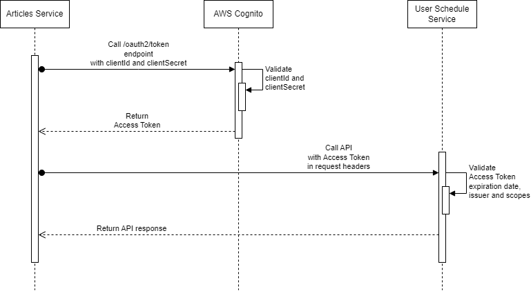

## Configuring the Authorization Server

First, we configure our Authorization Server for our applications to be able to authorize themselves, request and validate tokens and check the scopes.
To do that, we need to first sign in to the AWS Console and select the region where AWS Cognito is available.

The steps for the Authorization Server configuration would include:
1. Cognito User Pool and App Client creation
2. Creating a Resource Server with Custom Scopes
3. Assigning the Scopes to the newly created App Client
4. Create a Domain as an entrypoint for our app client

We'll proceed with the creation of a user pool, which is a selectable option at AWS Cognito main panel.

### Creating a User Pool and an App Client

At Step 1 we need to select creation of a User Pool specifically, as Federated Identity Providers are mainly used in cases when there is an external source of users which needs to be connected to AWS in order for these users to get access to AWS services.
Sign-in options are not mandatory for selection in our specific case, as we are not planning to have actual users in our pool at the moment.
However, this might come in handy when we start to expand our system and start integrating user interactions. And once sign in options are configured, they can't be changed later. 

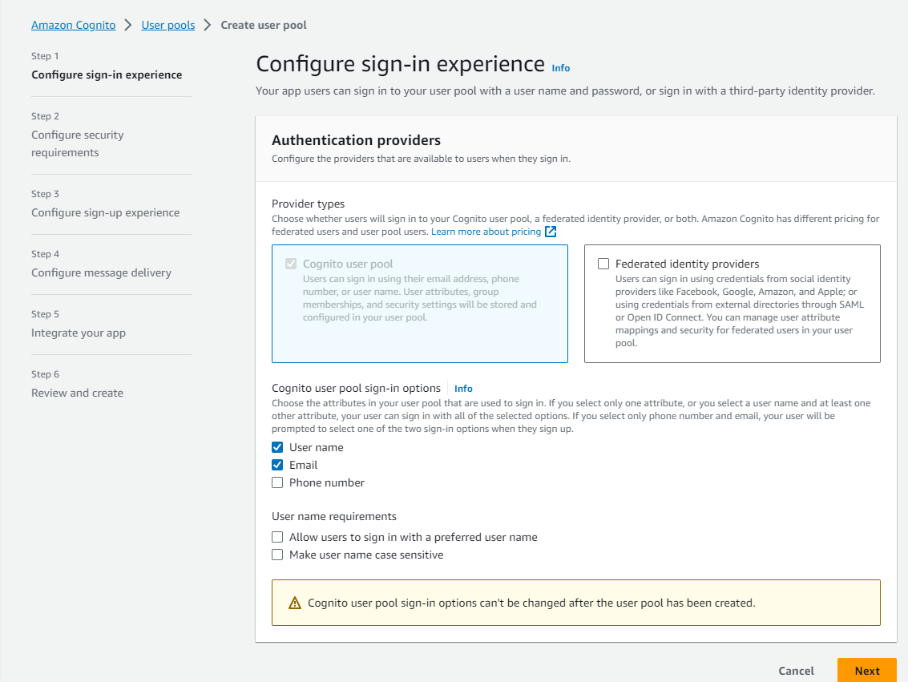

At Step 2, we configure password, MFA and account recovery policies, which do not affect our server-to-server communication flow, and impact only user experience.
So, feel free to specify desirable options.

At Step 3, you can enable or disable self registration for the users. This is an important option, as it may make your user pool publicly available and anyone in the internet would be able to register in it.
We'll disable this option for our pool for security purposes.
Apart from that, you can also configure user account verification flow and user attribute changes confirmation flow - which do not impact server-to-server communications.

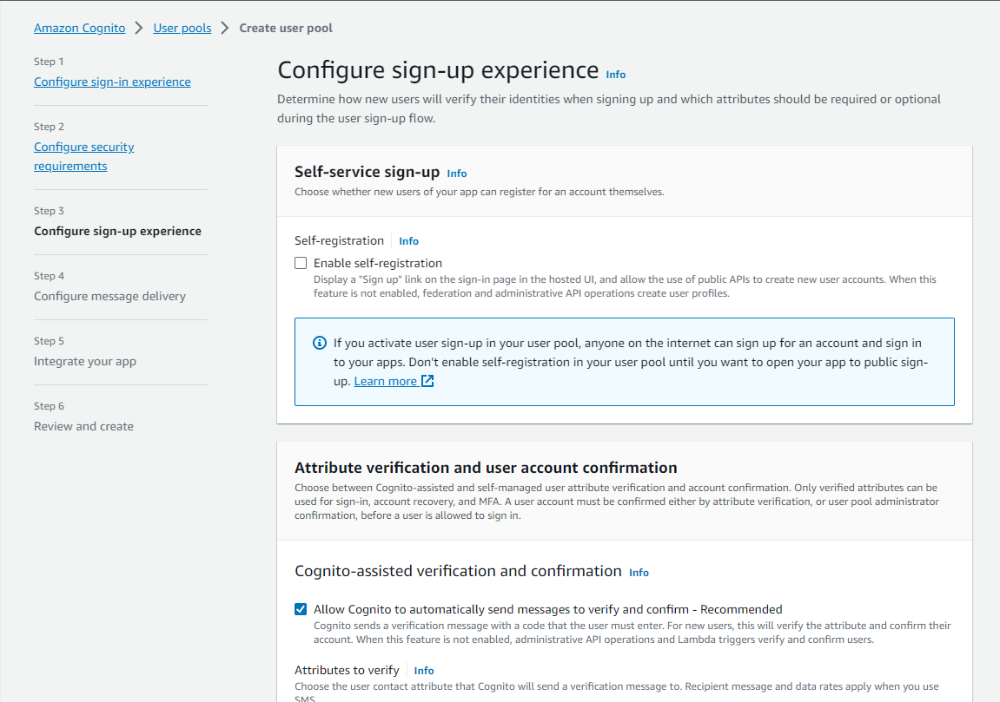

Step 4 is about email messages delivery to end users in case of different kinds of their interactions with our pool.
We'll switch the delivery mechanism to AWS Cognito here for configuration simplicity.

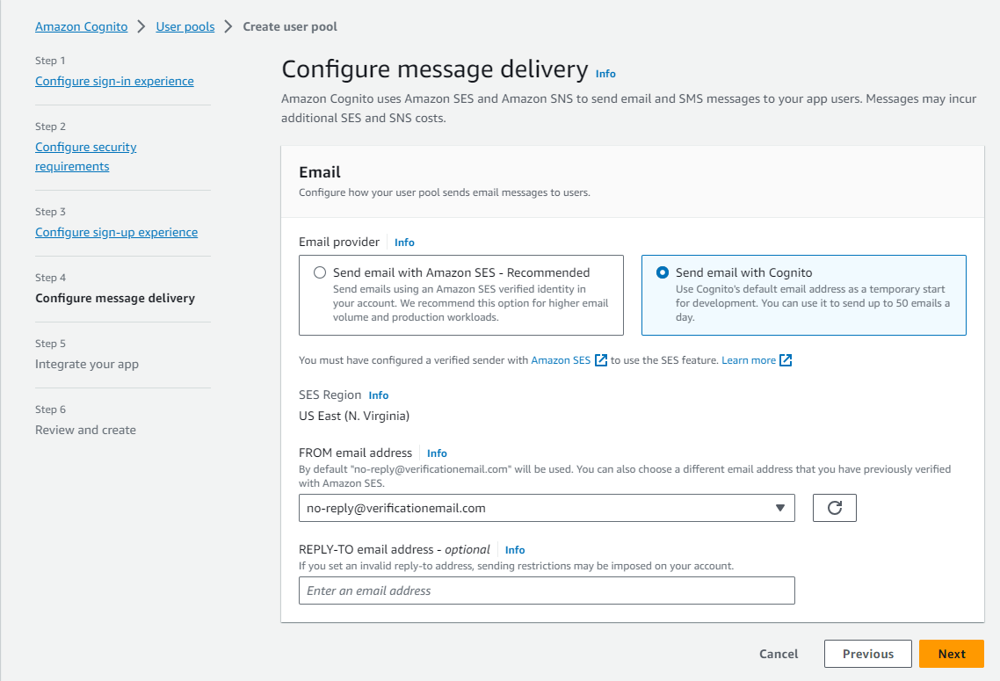

Step 5 is important. Here we need to specify a unique name for our user pool and configure an initial app client.
User Pool Name can't be changed once set, so we need to name it carefully. Hosted UI configurations are out of scope of our case, so we'll skip these options.

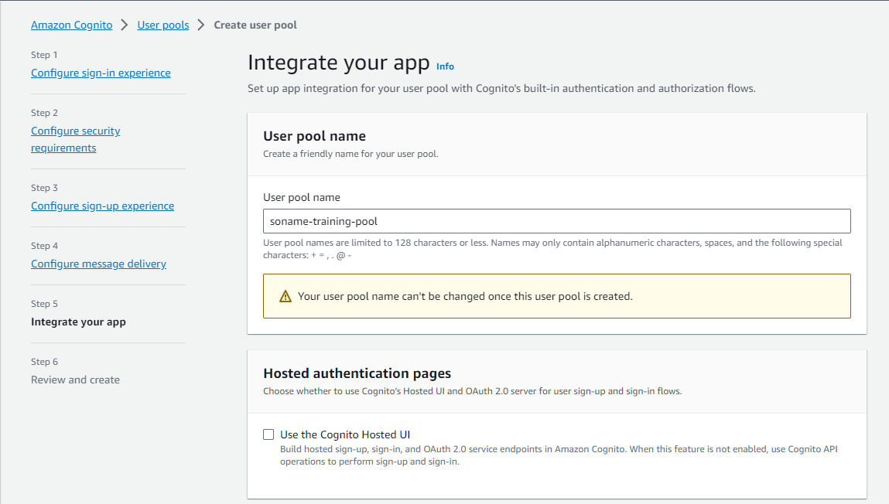

Initial app client name in our case can match the name of our service which would act as the client.
We need to select the Confidential Client type, as the communication would not require a user intervention or any other flows via browser.
Plus we'll need to select Client Secret generation in order to successfully implement Client Credentials Flow.

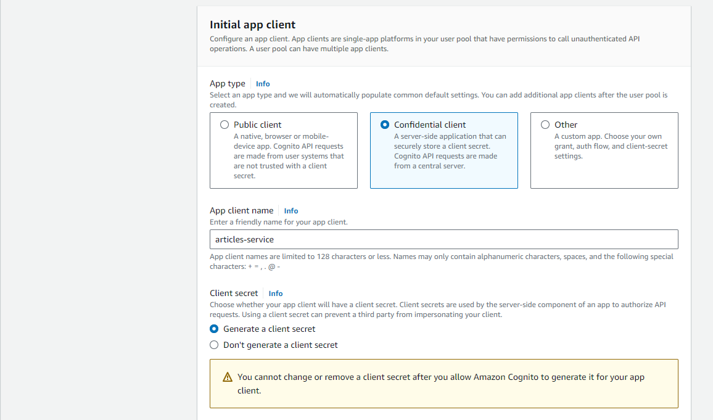

Advanced app client settings are quite important for us as they impact access tokens lifecycle (Access Token Expiration for our case - we'll keep default 60 minutes).
They also contain some important sign in settings for user perspective, which we won't touch now.
Note that all settings related to Refresh Tokens are not of our concern for our particular case, because Client Credentials Flow does not support Refresh Tokens.

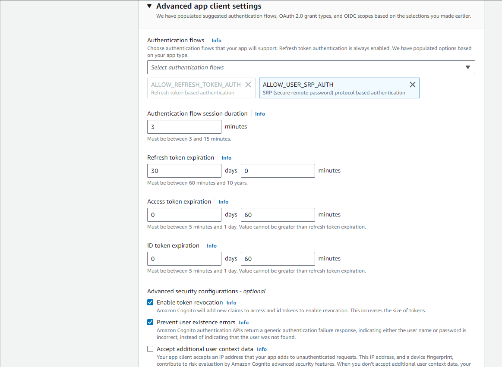

Don't forget to set the tags for the resource, for it to be more easily manageable within your ecosystem, and hit Create.

Once we are at the screen of our newly created user pool, we would like to note the User Pool Id, which is automatically generated by AWS. We will need this one later in our configs.

### Creating a Resource Server with Custom Scopes

Now when we have a User Pool and an App Client for Articles Service created, we now need to create a configuration for our Resource Server, which is User Schedule Service.
To do that, we need to proceed to the App Integration blade at our User Pool dashboard and find Resource Server section.
Proceed with creation of a Resource Server.

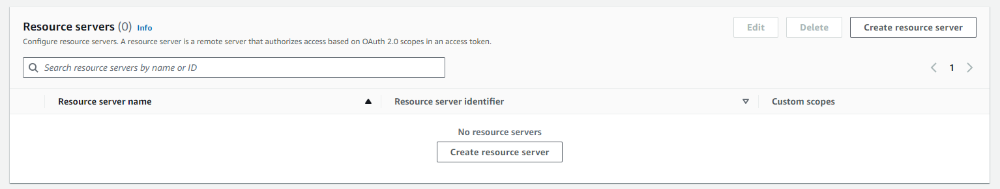

At the creation screen, we need to provide a name for the resource server, ID (this one is important as it will be later used in the app configs), and custom scopes.
We put the same name for server name and server id for our case, and specify 2 custom scopes: one for reading schedules, and one for updating them. 
This corresponds to our protected APIs in User Schedule Service, and we would like to assign these scopes partially to different clients - in order to have role-based access control between our communicating servers.

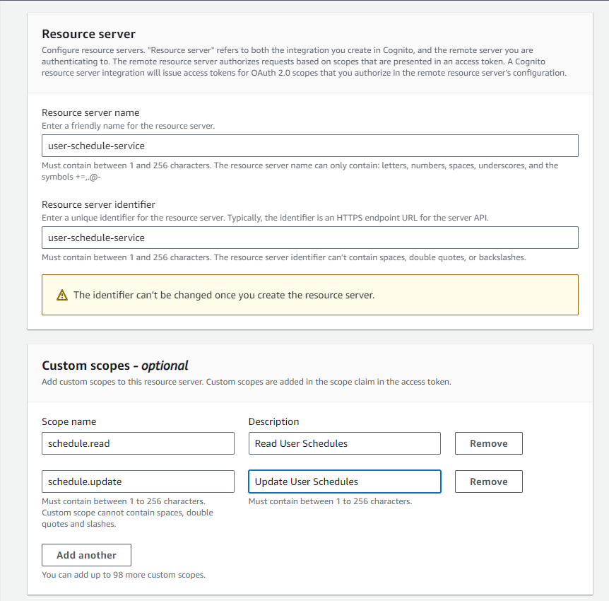

### Assigning the Scopes to the App Client

Now we need to assign the scopes to our newly created articles-service app client for our app to be able to call specific APIs of user-schedule-service Resource Server.
To do that, we need to go back to our App Integration blade of our User Pool and select our articles-service app client:


Then we head to Hosted UI section and click Edit.
There we need to select the identity provider the client would be able to sign in through (our Cognito User Pool), grant type (Client Credentials for our case) and the scopes assigned to the client.
For demonstration purposes, we will specifically deselect schdule.update scope and select the schedule.read scope - to show that the APIs will be available to the client only if the corresponding scope is assigned.

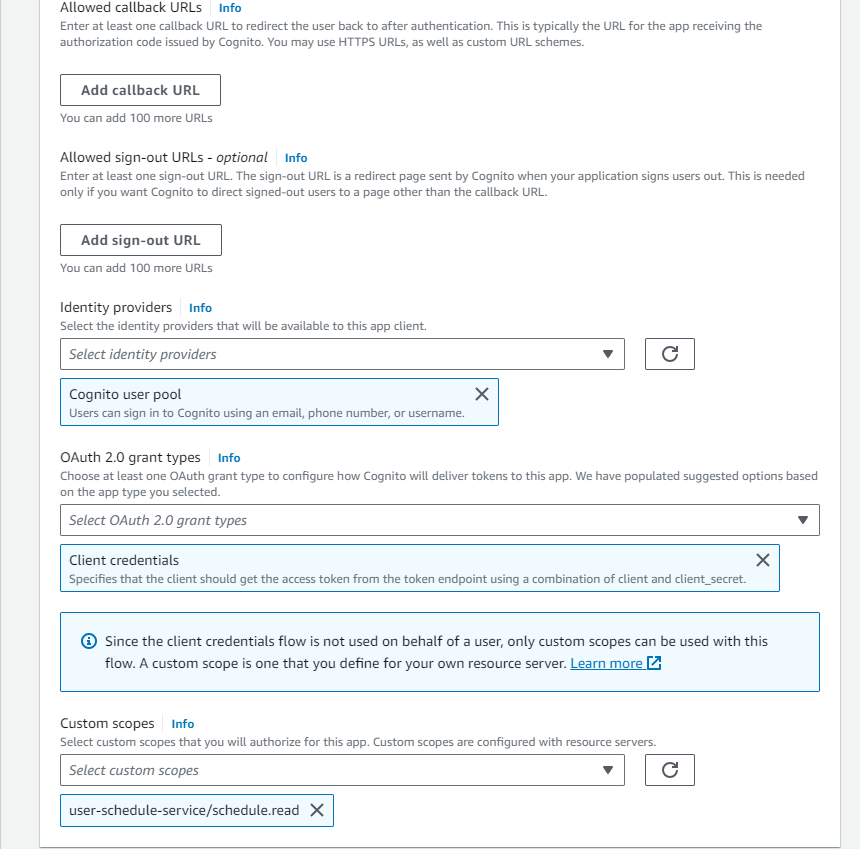

### Create a Cognito Domain

The last step would be to configure a domain name for our Authorization Server, so that our app client would be able to request an access token from AWS Cognito, in order to send it to the resource server.
We need to head back to the App Integration blade of our Cognito User Pool, and select either Create a Cognito Domain or Create a Custom Domain in front of the Domain section:

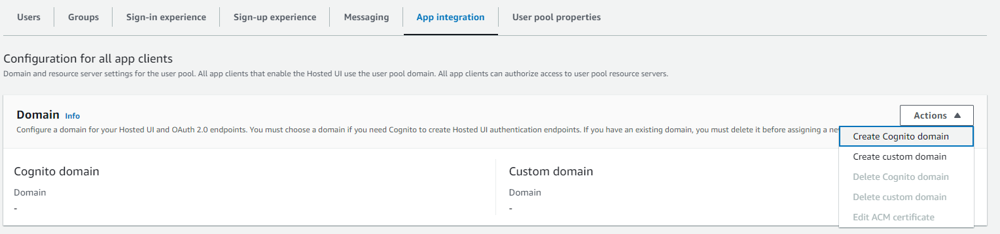

We will select Cognito Domain for simplicity.
All we need to do next is to set up a unique domain name for our authorization server endpoints:


### Testing the Configuration

After the setup done, we only need to test if our configuration works correctly, and we can obtain an access token.

We will refer to the documentation provided by AWS [here](https://docs.aws.amazon.com/cognito/latest/developerguide/token-endpoint.html) to learn the URI of the access token endpoint.
And we'll try to run a request to see if we get a meaningful access token based on our data.

To compose it, we need the following data:
- Token endpoint hostname: it's the Domain we created at the last step of our configuration.
- Client ID: can be obtained at the corresponding App Client panel for our selected client.
- Client Secret: can be obtained at the corresponding App Client panel for our selected client as well.

For our case, the request would look like the following:

```
curl --location 'https://soname-training-auth.auth.us-east-1.amazoncognito.com/oauth2/token' \
--header 'Content-Type: application/x-www-form-urlencoded' \
--data-urlencode 'grant_type=client_credentials' \
--data-urlencode 'client_id=cousnlblnjks3l1gc7ph18nao' \
--data-urlencode 'client_secret=1r5l7lihjju3ki17ldqnh792f226nlqo4a6pjv08c0p4cmbole0h'
```

Once we execute it, we'll get a JSON response, containing an access token in the corresponding field.

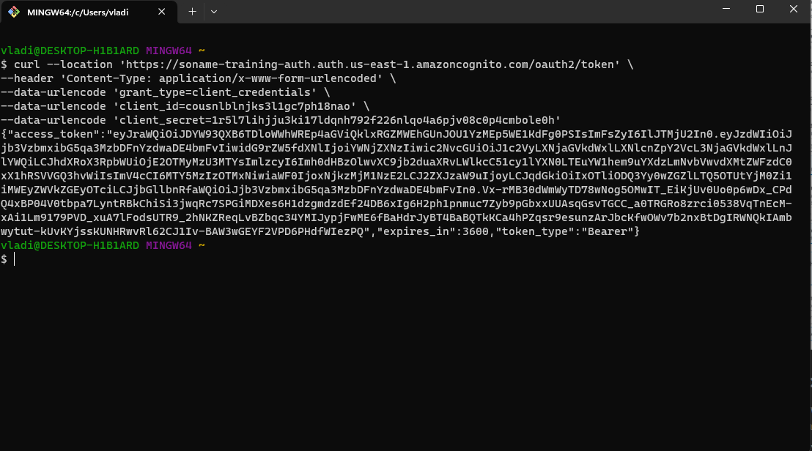

In essence, the token is in fact a JWT encoded data structure, which includes a whole set of headers, fields (claims) and a signature.
A signature is what makes such kind of tokens secure - a resource server can verify the signature and make sure the tokens have not been tampered with.

Once we decode the token, we'll get the following data structure in the payload:

```json
{
  "sub": "cousnlblnjks3l1gc7ph18nao",
  "token_use": "access",
  "scope": "user-schedule-service/schedule.read",
  "auth_time": 1693235716,
  "iss": "https://cognito-idp.us-east-1.amazonaws.com/us-east-1_XQIUFCxoZ",
  "exp": 1693239316,
  "iat": 1693235716,
  "version": 2,
  "jti": "199b847c-0dfe-4995-b34f-b1a2eedda297",
  "client_id": "cousnlblnjks3l1gc7ph18nao"
}
```

Note that it has client ID, expiration date, token type, issuer URL and scopes - all included in the access token.
This information primarily will be used by our Resource Server to validate the access to the API.

All we need to do is to code our applications in that way - to exchange and verify the tokens.

## Configuring the Client

To implement our Client, we are going to create a Java Web application using Spring Boot with Reactive stack as a general framework and Gradle as a building tool.
In general, we are going to have a REST API exposed to the public, which is going to call protected User Schedule Service to get or manipulate data.

The code is available in the following repository: https://github.com/vdektiarev/oauth2-client-credentials-cognito-flow/tree/master/articles-service

As for dependencies, we need the bare minimum what is needed to create a Web app with Reactive stack and use an OAuth client library to make calls to the Authorization server:

```groovy
dependencies {
	implementation 'org.springframework.boot:spring-boot-starter-oauth2-client'
	implementation 'org.springframework.boot:spring-boot-starter-web'
	implementation 'org.springframework.boot:spring-boot-starter-webflux'
	testImplementation 'org.springframework.boot:spring-boot-starter-test'
}
```

First, we need to create a configuration for the app.
Starting with general security configuration, we would like to disable authentication, form logins and permit all service APIs for the public access:

```java
@Configuration
@EnableWebFluxSecurity
public class SecurityConfiguration {

    @Bean
    public SecurityWebFilterChain securityWebFilterChain(ServerHttpSecurity http) {
        return http
                .authorizeExchange()
                .pathMatchers("/articles/**").permitAll()
                .anyExchange().authenticated()
                .and()
                .httpBasic()
                .and()
                .formLogin().disable()                    
                .csrf().disable() 
                .build();
    }
}
```

Then we proceed with Web Client configuration - the component which would make the calls to User Schedule Service API.
We need to declare a client registration component which consumes all the config like client id, client secret and token endpoint - and then declare a web client with that registration:

```java
@Configuration
public class CognitoWebClientConfiguration {

    @Bean
    ReactiveClientRegistrationRepository getRegistration(
            @Value("${spring.security.oauth2.client.provider.cognito.token-uri}") String token_uri,
            @Value("${spring.security.oauth2.client.registration.cognito.client-id}") String client_id,
            @Value("${spring.security.oauth2.client.registration.cognito.client-secret}") String client_secret
    ) {
        ClientRegistration registration = ClientRegistration
                .withRegistrationId("cognito")
                .tokenUri(token_uri)
                .clientId(client_id)
                .clientSecret(client_secret)
                .authorizationGrantType(AuthorizationGrantType.CLIENT_CREDENTIALS)
                .build();
        return new InMemoryReactiveClientRegistrationRepository(registration);
    }

    @Bean(name = "cognito")
    WebClient webClient(ReactiveClientRegistrationRepository clientRegistrations) {
        InMemoryReactiveOAuth2AuthorizedClientService clientService = new InMemoryReactiveOAuth2AuthorizedClientService(clientRegistrations);
        AuthorizedClientServiceReactiveOAuth2AuthorizedClientManager authorizedClientManager = new AuthorizedClientServiceReactiveOAuth2AuthorizedClientManager(clientRegistrations, clientService);
        ServerOAuth2AuthorizedClientExchangeFilterFunction oauth = new ServerOAuth2AuthorizedClientExchangeFilterFunction(authorizedClientManager);
        oauth.setDefaultClientRegistrationId("cognito");
        return WebClient.builder()
                .filter(oauth)
                .build();
    }
}
```

Then we declare the configuration properties which would be used by the application, including configs from Cognito and general app-related configs.
The application needs the endpoint, client id and client secret to be able to make calls to Cognito API and to get the Access Token.
The Web Client would then put this token into request headers to make the calls to User Schedule Service.

```yaml
server:
  port: 8082

spring:
  main:
    web-application-type: reactive
  security:
    oauth2:
      client:
        registration:
          cognito:
            client-id: <your_client_id>
            client-secret: <your_client_secret>
            authorization-grant-type: client_credentials
        provider:
          cognito:
            token-uri: <your_pool_domain>/oauth2/token

user-schedule-service:
  get-schedule:
    url: http://localhost:8081/user-schedule/schedule
  update-schedule:
    url: http://localhost:8081/user-schedule/schedule/{id}
```

Ideally you wouldn't keep sensitive data like Client Secrets directly in you application properties files - as keeping such data directly in the codebase can be a major security risk.
In real production scenarios you may want to look at AWS Services like Systems Manager Parameter Store or Secrets Manager to keep your credentials there, and assign policies to your CI/CD pipeline processes to be able to fetch the credentials during application deployment.

Proceeding with service level declaration, we want to implement the logic to make the calls to User Schedule Service.
Let's create a simple service level component to do the schedule reads and updates, with simple exception handling:

```java
@Service
public class UserScheduleService {

    @Value("${user-schedule-service.get-schedule.url}")
    private String userScheduleServiceGetScheduleUrl;

    @Value("${user-schedule-service.update-schedule.url}")
    private String userScheduleServiceUpdateScheduleUrl;

    @Autowired
    private WebClient cognitoWebClient;

    public Mono<String> getUserSchedule(String userName) {
        return cognitoWebClient
                .get()
                .uri(userScheduleServiceGetScheduleUrl, uriBuilder ->
                        uriBuilder.queryParam("userName", userName).build())
                .retrieve()
                .onStatus(HttpStatusCode::isError, ClientResponse::createException)
                .bodyToMono(String.class);
    }

    public Mono<String> updateUserSchedule(String scheduleId) {
        return cognitoWebClient
                .put()
                .uri(userScheduleServiceUpdateScheduleUrl, scheduleId)
                .retrieve()
                .onStatus(HttpStatusCode::isError, ClientResponse::createException)
                .bodyToMono(String.class);
    }
}
```

And all we have to do now is to introduce the API level of our service:

```java
@RestController
@RequestMapping("/articles")
public class ArticlesController {

    @Autowired
    private UserScheduleService userScheduleService;

    @GetMapping("/user-availability/{name}")
    public Mono<String> getUserAvailabilityForArticles(@PathVariable String name) {
        return userScheduleService.getUserSchedule(name);
    }

    @PostMapping
    public Mono<String> postArticle(@RequestBody Article article) throws ExecutionException, InterruptedException {
        Mono<String> scheduleServiceResponse = userScheduleService.updateUserSchedule(article.getScheduleId());
        String schedulingResponse = scheduleServiceResponse.toFuture().get();
        // call to some DB to save the article
        return Mono.just("Article from userId:" + article.getUserId() +
                " has been posted! Schedule update: " + schedulingResponse);
    }
}
```

For simplicity, we won't fully implement all the APIs, we want to keep them at the minimal level to demonstrate the authorization process between two applications.
In reality, the APIs won't do anything but some string response generation and calls to other services.

The main entrypoint for the Java application remains a default for a general Spring Boot application, nothing special is needed here:

```java
@SpringBootApplication
public class ArticlesServiceApplication {

	public static void main(String[] args) {
		SpringApplication.run(ArticlesServiceApplication.class, args);
	}

}
```

We now leave the app as it is and proceed with Resource Server creation - and then we'll test the integration.

## Configuring the Resource Server

To implement our Resource Server, this time, we are going to create a general Spring Boot Java Web application with no reactive stack - and still using Gradle as a building tool.
The service would look similar to Articles Service, but with differences on API level and security configuration - this time all our APIs would require both authentication and an appropriate scope assigned.

The code is available in the following repository: https://github.com/vdektiarev/oauth2-client-credentials-cognito-flow/tree/master/user-schedule-service

As for dependencies, we require Spring Boot Web stack and libraries required for an app to act as a Resource Server:

```groovy
dependencies {
	implementation 'org.springframework.boot:spring-boot-starter-oauth2-resource-server'
	implementation 'org.springframework.boot:spring-boot-starter-web'
	testImplementation 'org.springframework.boot:spring-boot-starter-test'
}
```

This time, declaring a security configuration, we would like to first check an access token, and additionally check different scopes for different endpoints.
To implement these checks, our configuration can look like the following:

```java
@Configuration
public class SecurityConfiguration {

    private static final String SCOPE_PREFIX = "SCOPE_";

    @Value("${resourceserver.id}")
    private String resourceServerId;

    @Bean
    public SecurityFilterChain filterChain(HttpSecurity http) throws Exception {
        http.authorizeRequests(authz -> authz.requestMatchers(HttpMethod.GET, "/user-schedule/schedule/**")
                        .hasAuthority(getAuthority(SecurityScope.SCHEDULE_READ))
                        .requestMatchers(HttpMethod.PUT, "/user-schedule/schedule/**")
                        .hasAuthority(getAuthority(SecurityScope.SCHEDULE_UPDATE))
                        .anyRequest()
                        .authenticated())
                .oauth2ResourceServer(oauth -> oauth.jwt(Customizer.withDefaults()));
        return http.build();
    }

    private String getAuthority(SecurityScope scope) {
        return SCOPE_PREFIX + resourceServerId + "/" + scope.getId();
    }
}
```

Here we need a resource server id declared, as Cognito generates scope names as <resourceserver.id>/<scope_name>.
For example, for our case, the read endpoint scope would be "user-schedule-service/schedule.read".
"SCOPE_" prefix is required by Spring libraries when validated.
And scope names from our Resource Server declaration in AWS Cognito are extracted to a separate enum for better maintainability.

We still need to declare the application config, where we need to put the issuer URI of Access Tokens to be validated, that they came from a valid source, and resource server id - to validate the scopes.

```yaml
server:
  port: 8081

spring:
  security:
    oauth2:
      resourceserver:
        jwt:
          issuer-uri: https://cognito-idp.<your_region>.amazonaws.com/<your_user_pool_id>

resourceserver:
  id: <your_resource_server_id>
```

Now all we need is to declare the API which would be used by Articles Service:

```java
@RestController
@RequestMapping("/user-schedule")
public class UserScheduleController {

    @GetMapping("/schedule")
    public String getUserSchedule(@RequestParam String userName) {
        return userName + " is available!";
    }

    @PutMapping("/schedule/{id}")
    public String updateSchedule(@PathVariable String id) {
        return id + " has been updated!";
    }
}
```

The main application entrypoint has nothing special as well - looks similar to the one declared in Articles Service.

## Testing the Flow

Now, having all applications coded and Cognito User Pool configured, we can finally launch and test the flow.

Launching the applications would require Java 17 installed and can be done via command:

```
./gradlew bootRun 
```

We can then try to call our /user-availability API to make sure we've got access to it and are able to can the underlying User Schedule Service:

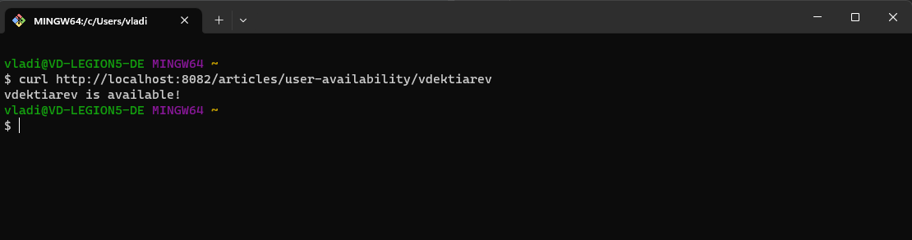

Since it works, let's then try to call our Articles Posting endpoint - which is not supposed to work now, as we assigned only "schedule.read" scope to our App Client:

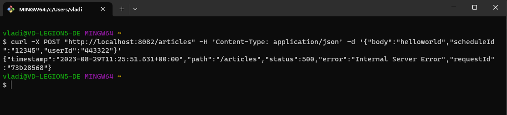

And in the logs we will see an error like this one:

"Caused by: org.springframework.web.reactive.function.client.WebClientResponseException$Forbidden: 403 Forbidden from PUT http://localhost:8081/user-schedule/schedule/12345"

Which is expected, as, again, we did not assign "schedule.update" scope to our articles-service app client.
Let's fix that by going to the App Client - Hosted UI settings and assigning the appropriate scope:

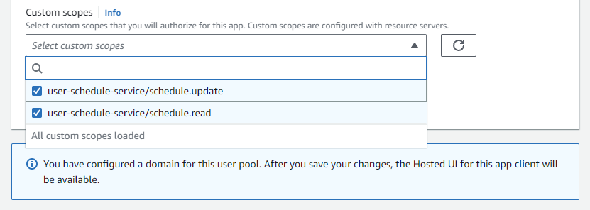

After we do the save, we can test the changes:

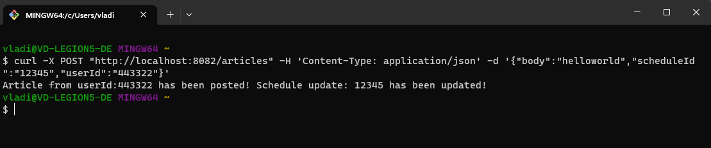

And they work as expected!

## Summary

In this article, we've delved into the core concepts and benefits of the OAuth 2.0 protocol, focusing on the Client Credentials Flow — a vital grant type designed for server-to-server communication. 
We've explored the fundamental components of OAuth 2.0, from clients and resource servers to authorization servers and access tokens. 
With a deeper understanding of these components, we've highlighted how the Client Credentials Flow streamlines interactions and enhances security for server applications.

Our journey led us to AWS Cognito, Amazon's powerful authentication and authorization service. 
By showcasing how to configure AWS Cognito to facilitate the Client Credentials Flow, we've demonstrated a real-world implementation that bridges theory and practice. 
This hands-on approach equips you with the skills needed to establish secure communication channels between your own server applications.

As you embark on your own endeavors involving server-to-server communication, remember the significance of selecting the appropriate grant type. 
While the Client Credentials Flow offers remarkable efficiency and security, it's essential to consider the context and requirements of your interactions. 
Whether it's securing APIs, enhancing microservices communication, or safeguarding data exchanges, OAuth 2.0 combined with AWS Cognito provides a robust foundation.

With this newfound knowledge, you're poised to confidently navigate the intricate realm of secure server communications. 
By harnessing the capabilities of OAuth 2.0 and leveraging AWS Cognito's features, you can pave the way for seamless, authenticated, and authorized interactions between your server applications. 
As you continue to explore and innovate, you contribute to a more secure and interconnected digital ecosystem.
